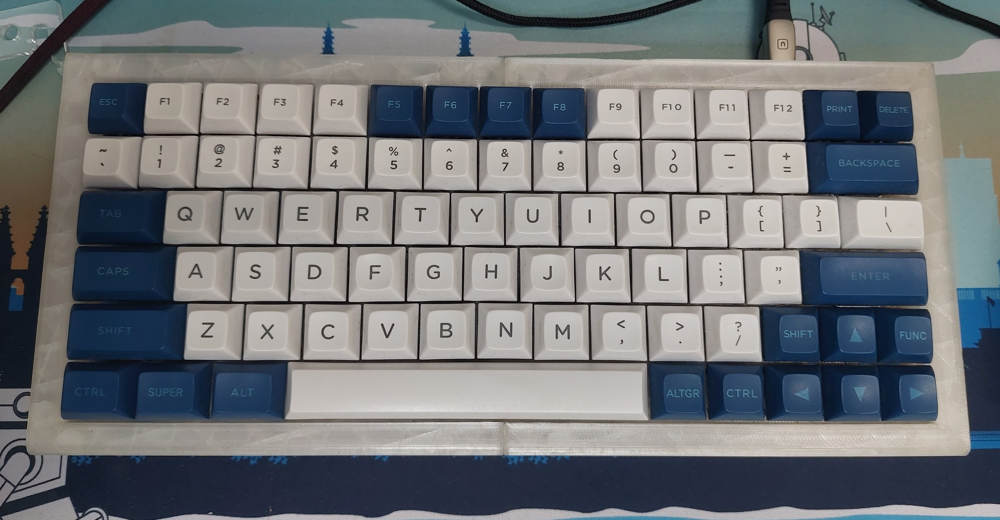

# afk79



QMK Supported: 0.33.0

* Keyboard Maintainer: [datapaganism](https://github.com/datapaganism)
* Hardware Supported: STM32F401 Black Pill (with 22K resistor between A10 and 3.3V)
* Hardware Availability: Handwire only atm

Clone into `qmk_firmware/keyboards`

Make example for this keyboard (after setting up your build environment):
```
   qmk compile -kb afk79 -km default
```

Flashing example for this keyboard:
```
   qmk flash -kb afk79 -km default
```

See the [build environment setup](https://docs.qmk.fm/#/getting_started_build_tools) and the [make instructions](https://docs.qmk.fm/#/getting_started_make_guide) for more information. Brand new to QMK? Start with our [Complete Newbs Guide](https://docs.qmk.fm/#/newbs).

## Bootloader

Enter the bootloader in 3 ways:

* **Bootmagic reset**: Hold down the key at (0,0) in the matrix (usually the top left key or Escape) and plug in the keyboard
* **Physical reset button**: Briefly press the button on the back of the PCB - some may have pads you must short instead
* **Keycode in layout**: Press the key mapped to `QK_BOOT` if it is available
